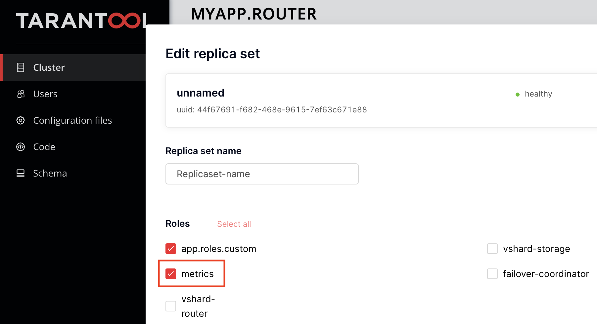

.. _getting_started_cartridge:

Cartridge application: getting started
======================================

The ``metrics`` module is tightly integrated with
the `Cartridge <https://www.tarantool.io/en/doc/latest/book/cartridge/>`__ framework.
To enable this integration, a permanent role called ``metrics`` has been introduced.
To enable this role, follow the steps below.

.. _getting_started_cartridge-setup:

Module setup
------------

First, install the latest version of ``metrics``. For details,
:ref:`check the installation guide <install-rockspec>`.

Also, you need to install the separate ``cartridge-metrics-role`` rock. To do this:

#. Add the ``cartridge-metrics-role`` package to the dependencies in the ``.rockspec`` file:

    .. code-block:: lua

        dependencies = {
            ...
            'cartridge-metrics-role',
            ...
        }

#.  Next, install the missing dependencies:

    .. code-block:: shell

        tt rocks make
        # OR #
        tarantoolctl rocks make
        # OR #
        cartridge build

After the ``cartridge-metrics-role`` installation, enable this package in the list of roles in ``cartridge.cfg``:

.. code-block:: lua

    local ok, err = cartridge.cfg({
        roles = {
            ...
            'cartridge.roles.metrics',
            ...
        },
    })

Then, configure the ``metrics`` module in either of two ways:

*   add the ``metrics`` configuration section to your cluster configuration;
*   specify the configuration in the separate ``metrics.yml`` file.

In the configuration, specify the response format and the addresses at which the commands are available:

.. code-block:: yaml

    metrics:
      export:
        - path: '/path_for_json_metrics'
          format: 'json'
        - path: '/path_for_prometheus_metrics'
          format: 'prometheus'
        - path: '/health'
          format: 'health'

Learn more about `Cartridge configuration <https://www.tarantool.io/en/doc/latest/book/cartridge/cartridge_dev/#managing-role-specific-data>`__.

..  note::

    Instead of configuring the cluster configuration, you can also use the
    `set_export <https://www.tarantool.io/en/doc/latest/book/monitoring/api_reference/#lua-function.metrics.set_export>`__
    command.

Now the commands' data is accessible at the following addresses:

..  code-block:: shell

    http://url:port/path_for_json_metrics
    http://url:port/path_for_prometheus_metrics
    http://url:port/health

where ``url:port`` -- the address and Cartridge HTTP port of a specific instance of the application.

You can visualize the data in
`Grafana dashboard <https://www.tarantool.io/en/doc/latest/book/monitoring/grafana_dashboard/#monitoring-grafana-dashboard-page>`__.

After the role has been initialized, the default metrics are enabled
and the global ``alias`` label is set.

..  note::

    Since **0.6.1**, the ``alias`` label value is set by the ``alias`` or ``instance_name``
    instance :ref:`configuration option <cartridge-config>`.

You can use the functionality of any metrics package.
To do this, get the package as a Cartridge service and call it with the ``require()`` like a regular package:

..  code-block:: lua

    local cartridge = require('cartridge')
    local metrics = cartridge.service_get('metrics')

.. _getting_started_cartridge-if_we_use_old_version:

Additional steps for older versions of the metrics module
---------------------------------------------------------

Since version **0.6.0**, the ``metrics`` role is permanent and enabled on instances by default.
If you use an old version of ``metrics``, you need to enable the role in the interface first:

.. _getting_started_cartridge-add_metrics_to_http_api_command:

Adding metrics to HTTP API commands of the application
------------------------------------------------------

You can connect the standard ``http_server_request_latency`` metric to your application's HTTP API
commands. This metric records the number of invocations and the total execution time (latency) of
each individual command. To connect this, wrap each API handler with
the ``metrics.http_middleware.v1(...)`` function.

Example:

.. code-block:: lua

    local cartridge = require('cartridge')
    local server = cartridge.service_get('httpd') -- get the HTTP server module
    local metrics = cartridge.service_get('metrics') -- get the module of metrics

    local function http_app_api_handler(request) -- add test command
        return request:render({ text = 'Hello world!!!' })
    end

    local server = http_server.new('0.0.0.0', 8081)
    server:route({path = '/hello'}, metrics.http_middleware.v1(http_app_api_handler))
    server:start()

When calling the ``cartridge.service_get('metrics')`` command as an application (usually in a router),
add a dependency of this role on the role of ``metrics``:

.. code-block:: lua

    return {
        ...
        dependencies = {
            ...
            'cartridge.roles.metrics',
        }
    }

Now after the HTTP API calls ``hello`` at ``http://url:port/path_for_json_metrics``,
new data on these calls is available:

.. code-block:: json

    {
        "label_pairs": {
            "path": "/hello",
            "method": "ANY",
            "status": 200,
            "alias": "my-tnt-app"
        },
        "timestamp": 1679668258972227,
        "metric_name": "http_server_request_latency_count",
        "value": 9
    },
    {
        "label_pairs": {
            "path": "/hello",
            "method": "ANY",
            "status": 200,
            "alias": "my-tnt-app"
        },
        "timestamp": 1679668258972227,
        "metric_name": "http_server_request_latency_sum",
        "value": 0.00008015199273359
    },

The default type for this metric is ``histogram``. However,
it's :ref:`recommended <monitoring-getting_started-http_metrics_using_summary>` to use the ``summary`` type instead.

.. _getting_started_cartridge-advanced_settings:

Additional settings
-------------------

*   Since Tarantool Cartridge ``2.4.0``, you can set a zone for each
    instance in the cluster. When a zone is set, all the metrics on the instance
    receive the ``zone`` label.

*   You can set custom global labels with the following configuration:

    ..  code-block:: yaml

        metrics:
          export:
            - path: '/metrics'
              format: 'json'
          global-labels:
            my-custom-label: label-value

    Another option is to invoke the ``set_default_labels`` function in ``init.lua``:

    ..  code-block:: lua

        local metrics = require('cartridge.roles.metrics')
        metrics.set_default_labels({ ['my-custom-label'] = 'label-value' })

*   You can use the configuration below to choose the default metrics to be exported.
    If you add the ``include`` section, only the metrics from this section will be exported:

    ..  code-block:: yaml

        metrics:
          export:
            - path: '/metrics'
              format: 'json'
          # export only vinyl, luajit and memory metrics:
          include:
            - vinyl
            - luajit
            - memory

    If you add the ``exclude`` section,
    the metrics from this section will be removed from the default metrics list:

    ..  code-block:: yaml

        metrics:
          export:
            - path: '/metrics'
              format: 'json'
          # export all metrics except vinyl, luajit and memory:
          exclude:
            - vinyl
            - luajit
            - memory

    For the full list of default metrics, check the
    :ref:`API reference <metrics-api_reference-functions>`.

.. _getting_started_cartridge-custom_health_handle:

Creating a custom health check format
-------------------------------------

By default, the response of the health command contains a status code of

* ``200`` -- if everything is okay,
* ``500`` --  if the instance is unhealthy.

You can set your own response format in the following way:

.. code-block:: lua

    local health = require('cartridge.health')
    local metrics = cartridge.service_get('metrics')

    metrics.set_health_handler(function(req)
        local resp = req:render{
            json = {
                my_healthcheck_format = health.is_healthy()
            }
        }
        resp.status = 200
        return resp
    end)
